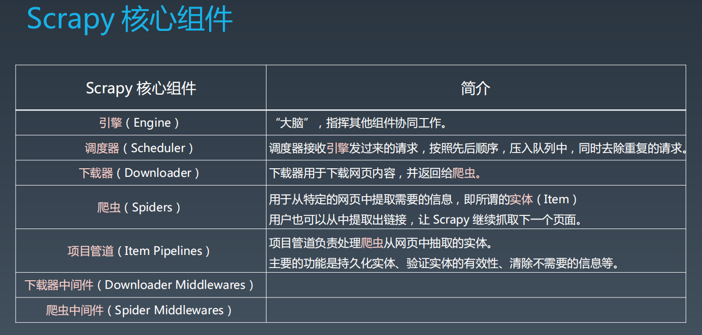
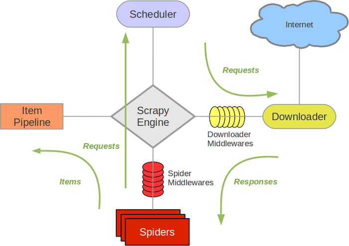
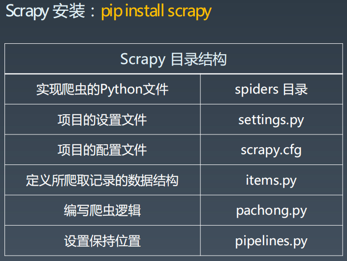
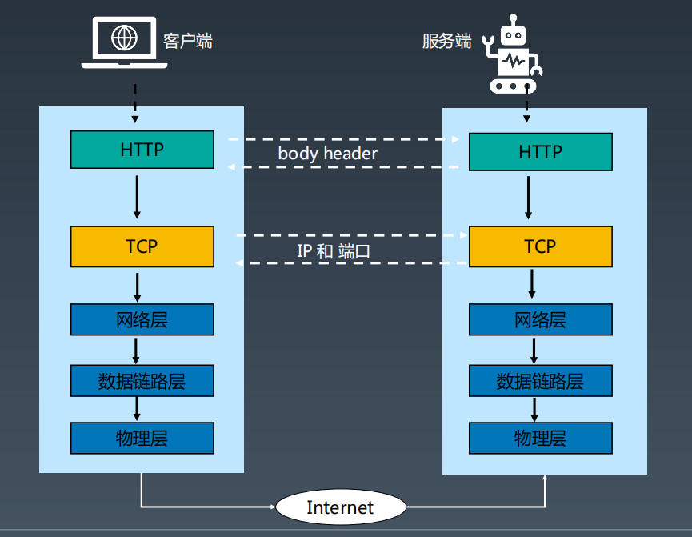

本周主要学习内容如下：
一、python爬虫基本开发方法，以及相关包的使用
二、爬虫框架scrapy相关知识和基本使用方法
其他学习内容：yield关键字、推导式、html基本结构，以及http协议简单介绍，简单回顾python基本语法

一、python爬虫基本开发方法：
主要分为两大步骤：1、从网页上抓取html文本，2、过滤html文本，获取所需信息；
1）抓取html文本：
两种方案：requests包和urllib；根据对比，requests相对更便捷;使用requests方法如下：
# 先引入requests
import requests
# 设置请求头，主要是user-agent属性
user_agent = 'Mozilla/5.0 (Windows NT 10.0; WOW64) AppleWebKit/537.36 (KHTML, like Gecko) Chrome/76.0.3809.132 Safari/537.36'
header = {'user-agent':user_agent}
# 设置目标网页地址，根据设置请求头，使用get方法请求网页内容（requests也包含post等方式）
douban= 'https://movie.douban.com/top250'
response = requests.get(douban,headers=header)
htmlContent = response.text
2）过滤html文本，抓取所需信息：
过滤html文本的两种方式：beautifulsoap和xpath；两种方式相比，xpath效率更高；
beautifulsoap使用方式：
# 引入bs4的BeautifulSoup
from bs4 import BeautifulSoup as bs
...
# 设置解析方式为html.parser，解析抓取的内容
bs_info = bs(htmlContent, 'html.parser')
# 在整个页面找class属性为hd的div元素，并遍历找div元素内的<a>元素
for tags in bs_info.find_all('div', attrs={'class': 'hd'}):
    for atag in tags.find_all('a',):
 # 获取所有链接 获取<a>中href属性值
        print(atag.get('href'))
        # 获取电影名字 获取中的内容文本
        print(atag.find('span',).text)
xpath使用方式：
# 引入lxml.etree
import lxml.etree
# 解析抓取内容
selector = lxml.etree.HTML(htmlContent)
# 找到id为content中h1元素中的第一个span元素的文本内容
film_name = selector.xpath('//*[@id="content"]/h1/span[1]/text()')
print(f'电影名称: {film_name}')
# 找到id为info中的第10个span元素的文本内容
plan_date = selector.xpath('//*[@id="info"]/span[10]/text()')
print(f'上映日期: {plan_date}')
# 找到id为interest_sectl中的第1个div元素中的第二个div元素中的strong元素的文本内容
rating = selector.xpath('//*[@id="interest_sectl"]/div[1]/div[2]/strong/text()')
print(f'评分：{rating}')
mylist = [film_name, plan_date, rating]
# 保存csv，引入pandas模块
import pandas as pd
movie1 = pd.DataFrame(data = mylist)
# windows需要使用gbk字符集
movie1.to_csv('./movie1.csv', encoding='utf8', index=False, header=False)

xpath简单语法：
/ 	从根节点选取。
// 	从匹配选择的当前节点选择文档中的节点，而不考虑它们的位置。
.	选取当前节点。
..	选取当前节点的父节点。
@x=y	表示找元素的x属性为y的元素
text()	获取元素中文本内容
@x	获取元素中x属性值

二、爬虫框架scrapy相关知识和基本使用方法
1、scrapy框架结构：

Scrapy主要包括了以下组件：

Scrapy运行流程大概如下：

1)、引擎根据所需域名调用对应域名的爬虫；
2)、爬虫向调度器发起请求，调度器对多个爬虫请求做去重处理，并返回给引擎；
3)、引擎再根据调度器返回的请求，通过下载器中间件将请求发给下载器做实际的网页抓取工作；
4)、网页内容抓取完毕，下载器再通过下载器中间件将相应返回给引擎；
5)、引擎收到响应后，再发给对应爬虫进行处理解析；
6)、爬虫解析后，根据需要，可以将处理好的信息转化为item形式，转发给管道进行持久化处理；或者从解析完的内容找到网页地址，再次发给调度器再次进行爬取；

2、scrapy基本使用方法：
1）安装scrapy：
pip install scrapy 
或者根据版本信息文件
pip install -r requirements.txt
2）创建scrapy项目目录：
scrapy startproject 项目名
3）进入 spiders目录创建爬虫：
scrapy genspider 爬虫名 域名
创建的scrapy项目目录结构如下：

3、scrapy项目中相关文件说明：
scrapy.cfg：scrapy项目配置文件。其中内容包括爬虫配置文件地址
settings.py：爬虫相关配置文件。主要对爬虫进行设置优化，包括user-agent，下载延迟，持久化管道等属性。
items.py：定义抓取记录转化的数据结构
pipelines.py：用于对item形式数据进行进一步处理，如db保存或者写入文件
pachong.py：爬虫逻辑文件，在spiders目录下，改文件命名会根据爬虫名自动创建，其中包括		用来爬虫逻辑类；
爬虫逻辑类说明：
class DoubanSpider(scrapy.Spider):
    # 定义爬虫名称
    name = 'douban'
    # 爬虫抓取网页边界
    allowed_domains = ['movie.douban.com']
    # 起始URL列表
    start_urls = ['https://movie.douban.com/top250']
    # 默认的parse函数，用来解析响应，parse函数会从start_urls获取数据
    def parse(self, response):
        pass

    # 爬虫启动时，引擎自动调用该方法，并且只会被调用一次，用于生成初始的请求对象（Request）。
    # start_requests()方法读取start_urls列表中的URL并生成Request对象，发送给引擎。
    # 引擎再指挥其他组件向网站服务器发送请求，下载网页
    def start_requests(self):
        # for i in range(0, 10):
            i=0
            url = f'https://movie.douban.com/top250?start={i*25}'
            yield scrapy.Request(url=url, callback=self.parse, dont_filter=False)
            # url 请求访问的网址
            # callback 回调函数，引擎回将下载好的页面(Response对象)发给该方法，执行数据解析
            # 这里可以使用callback指定新的函数，不是用parse作为默认的回调参数

爬虫类主要用到的函数及调用顺序为：
__init__() : 初始化爬虫名字和start_urls列表
start_requests() 调用make_requests_from url():生成Requests对象交给Scrapy下载并返回response
parse() : 解析response，并返回Item或Requests（需指定回调函数）。Item传给Item pipline持久化 ， 而Requests交由Scrapy下载，并由指定的回调函数处理（默认parse())，一直进行循环，直到处理完所有的数据为止。

其他内容：scrapy的选择器和yield、推导式、html、http协议
1、scrapy的选择器Selector：
提供xpath语法解析html文本内容，相比beautifulsoap，xpath方式	效率更高，用法如下：
import scrapy
from doubanmovie.items import DoubanmovieItem
from scrapy.selector import Selector

class DoubanSpider(scrapy.Spider):
...
def start_requests(self):
    # for i in range(0, 10):
        i=0
        url = f'https://movie.douban.com/top250?start={i*25}'
        # dont_filter设置是否用allowed_domains 属性设置抓取网页域名限制，true-不会限制，false-通过allowed_domains限制域名抓取
        yield scrapy.Request(url=url, callback=self.parse, dont_filter=False)
# 解析函数
    def parse(self, response):
        movies = Selector(response=response).xpath('//div[@class="hd"]')
        for movie in movies:
            title = movie.xpath('./a/span/text()')
            link = movie.xpath('./a/@href')
            print(title)
            print(link)
     	    # extract()函数会讲title内容释放出来成为字符串
            print(title.extract())
            print(link.extract())

2、python中的yield、推导式：
yield和return都是返回值关键字，主要区别在于，return是一次性将值全部返回，yield是可以根据需要一个值一个值返回，（更准确的说yield返回的值必须是对象）；
yield例zi：
def chain(x):
for i in range(x):
yield i
y=chain(5)
next(y)
list(y)
next(y) # 抛异常

推导式：一般用来生成新的列表，字典，集合，可以简化初始化方式
推导式例子：
mylist = []
for i in range(1, 11):
    if i > 5:
        mylist.append(i**2)
# 列表推导式
mylist2 = [i**2 for i in range(1, 11) if i > 5]
# 循环嵌套
mylist = [str(i) + j for i in range(1, 6) for j in 'ABCDE']
# 用推导式将字典转换为列表
mydict = {'key1': 'value1', 'key2': 'value2'}
mylist2 = [key + ':' + value for key, value in mydict.items()]
# 推导式生成字典
mydict = {i: i*i for i in (5, 6, 7)}
# 推导式实现字典的k-v互换
{value: key for key, value in mydict.items()}
# 推导式生成集合
myset = {i for i in 'HarryPotter' if i not in 'er'}
# 推导式生成 生成器
mygenerator = (i for i in range(0, 11))
print(mygenerator)
print(list(mygenerator))

3、html、http协议：

http协议是浏览器客户端和服务端信息交互协议：

